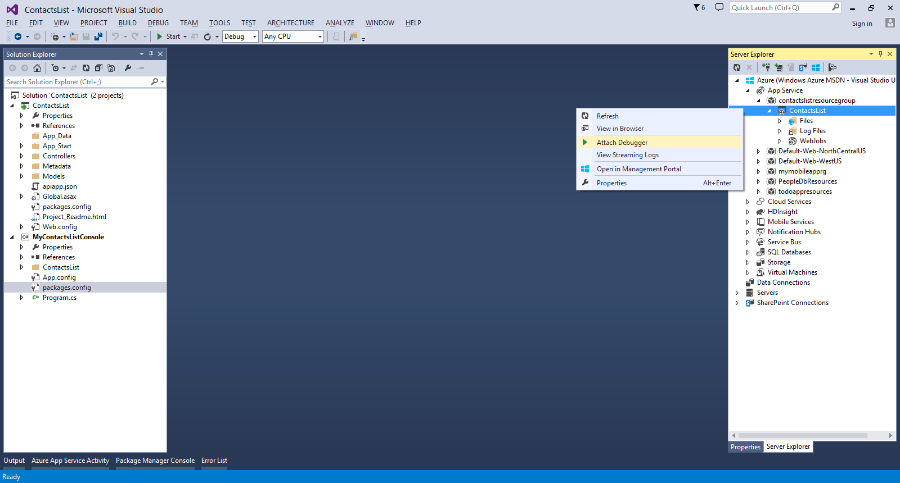
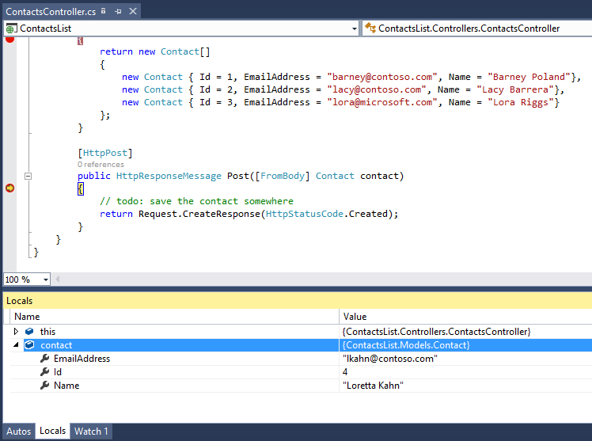

<properties 
	pageTitle="Remotely debug an Azure App Service API App" 
	description="Using Visual Studio to remotely debug an Azure App Service API App." 
	services="app-service\api" 
	documentationCenter=".net" 
	authors="bradygaster" 
	manager="wpickett" 
	editor="jimbe"/>

<tags 
	ms.service="app-service-api" 
	ms.workload="web" 
	ms.tgt_pltfrm="dotnet" 
	ms.devlang="na" 
	ms.topic="article" 
	ms.date="02/19/2015" 
	ms.author="bradyg;tarcher"/>

# Remotely debug an Azure App Service API App 

## Overview

Visual Studio's remote debugging capabilities have been extended to include support for API apps in Azure App Service. That means you can use familiar debugging tools to see your code running live in Azure. This topic demonstrates how to use Visual Studio's **API App Client** to generate client code that calls the deployed API app. Then you'll debug the client app and the API app simultaneously, with the API app running live in the cloud.

This tutorial is the last in a series of three:

1. In [Create an API App](app-service-dotnet-create-api-app.md) you created an API app project. 
* In [Deploy an API App](app-service-dotnet-deploy-api-app.md) you deployed the API appto your Azure subscription.
* In this tutorial, you use Visual Studio to remotely debug the code while it runs in Azure.

## Generate an API app client 

The API App tools in Visual Studio make it easy to generate C# code that calls to your Azure API Apps from desktop, store, and mobile apps. 

In Visual Studio, open the solution that contains the API app from the [first](app-service-dotnet-create-api-app.md) tutorial. Right-click the solution and select the **Add** > **New Project**.

Select the **Windows Desktop** category and **Console Application** project template.

Right-click the console application project and select **Add** > **Azure API App Client**. 

	
In the dialog, select the **Download** option. From the drop-down list, select the API app that you created earlier. Click **OK**. 

The wizard will download the API metadata file and generate a typed interface for invoking the API App.

Once code generation is complete, you'll see a new folder in Solution Explorer, with the name of the API app. This folder contains the code that implements the client and data models. 

Open the **Program.cs** file from the project root and replace the **Main** method with the following code: 

	static void Main(string[] args)
    {
        var client = new ContactsList();

        // Send GET request.
        var contacts = client.Contacts.Get();
        foreach (var c in contacts)
        {
            Console.WriteLine("{0}: {1} {2}",
                c.Id, c.Name, c.EmailAddress);
        }

        // Send POST request.
		client.Contacts.Post(new Models.Contact
	    {
	        EmailAddress = "lkahn@contoso.com",
	        Name = "Loretta Kahn",
	        Id = 4
	    });

        Console.WriteLine("Finished");
        Console.ReadLine();
    }

From the **View** menu, select **Server Explorer**. In the Server Explorer window, expand the *Azure > App Service** node. Find the resource group that you created when you deployed your API app. Right-click the node for your API app and select **Attach Debugger**. 

The remote debugger will try to connect. In some cases, you may need to retry clicking **Attach Debugger** to establish a connection, so if it fails, try again.

After the connection is established, open the **ContactsController.cs** file in the API App project, and add breakpoints at the `Get` and `Post` methods. They may not appear as active at first, but if the remote debugger is attached, you're ready to debug. 

To debug, right-click the console app in Solution Explorer and select **Debug** > **Start new instance**. Now you can debug the API app remotely and the client app locally, and see the entire flow of the data. 

The following screen shot shows the debugger when it hits the breakpoint for the `Post` method. You can see that the contact data from the client was deserialized into a strongly-typed `Contact` object. 

## Summary

Remote debugging for API Apps makes it easier to see how your code is running in Azure App Service. Rich diagnostic and debugging data is available right in the Visual Studio IDE for your remotely-running Azure API Apps.

