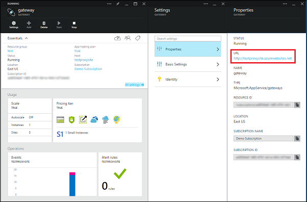

To be able to authenticate users, you must register your app with an identity provider. You must then register the provider-generated client secret with your App Service.

1. Log on to the [Azure Management Portal], click **Browse**, **Resource Group**, and then select the resource group of your Mobile App.

2. Select your gateway, and make a note of the **URL** value under **Properties**. You may need to provide this value to the identity provider when you register your app.

   	

3. Choose a supported identity provider from the list below and follow the steps to configure your app with that provider:

 - <a href="/en-us/documentation/articles/app-service-mobile-how-to-configure-active-directory-authentication-preview/" target="_blank">Azure Active Directory</a>
 - <a href="/en-us/documentation/articles/app-service-mobile-how-to-configure-facebook-authentication-preview/" target="_blank">Facebook login</a>
 - <a href="/en-us/documentation/articles/app-service-mobile-how-to-configure-google-authentication-preview/" target="_blank">Google login</a>
 - <a href="/en-us/documentation/articles/app-service-mobile-how-to-configure-microsoft-authentication-preview/" target="_blank">Microsoft Account</a>
 - <a href="/en-us/documentation/articles/app-service-mobile-how-to-configure-twitter-authentication-preview/" target="_blank">Twitter login</a>

	Your application is now configured to work with your chosen authentication provider.

<!-- URLs. -->
[Azure Management Portal]: https://manage.windowsazure.com/